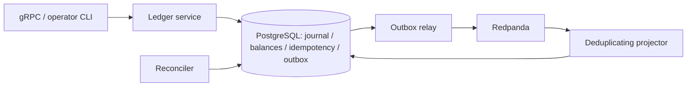

# IronLedger

[](https://github.com/demis1997/IronLedger/actions/workflows/ci.yml)

A Rust double-entry digital-asset ledger for auditable transaction orchestration. Accepted entries balance per asset; idempotency, balances, journal entries and outbox events commit together in PostgreSQL. Downstream projections can replay events and reject duplicate delivery.

## Engineering evidence

- Integer atomic amounts and per-asset balancing; invalid withdrawals and unbalanced submissions are rejected.
- Command-scoped idempotency: same payload replays its result; changed payload conflicts.
- Transactional PostgreSQL storage with account/balance locking and an outbox relay to Kafka-compatible Redpanda.
- Deduplicating projector, authoritative reconciliation, gRPC write/query/admin APIs and HTTP health/admin endpoints.
- In-memory unit tests and property tests, plus SQL migrations and architecture decision records.


```mermaid
flowchart LR
  Client[gRPC / operator CLI] --> Ledger[Ledger service]
  Ledger --> PG[(PostgreSQL: journal / balances / idempotency / outbox)]
  PG --> Relay[Outbox relay]
  Relay --> Kafka[Redpanda]
  Kafka --> Projector[Deduplicating projector]
  Projector --> PG
  Reconciler[Reconciler] --> PG
```

## Reproducible offline test demo

Rust 1.85.1 is pinned; dependencies are locked. From the repository root:

```sh
cargo test --locked -p ironledger-domain -p ironledger-ledger -p ironledger-projector -p ironledger-reconciler
cargo test --locked -p ironledger-integration-tests
cargo fmt --all -- --check
```

The first command was run on macOS ARM with Rust 1.85.1: **57 tests passed**, including three property tests configured for 256 cases each. Formatting also passed using the installed Rust 1.85.1 formatter. This is focused in-memory validation, not a database/broker benchmark. The integration-named crate currently contains in-memory tests; it must not be presented as proof of PostgreSQL/Redpanda fault recovery.

## Local services

Requires Docker Compose, Rust 1.85.1, CMake, pkg-config, OpenSSL development libraries and `protoc`. These full-service commands were inspected against source but **not executed during this portfolio update**:

```sh
cp .env.example .env
set -a
. ./.env
set +a
docker compose up -d postgres redpanda
cargo run --locked -p ledger-service
# Separate terminals, sourcing .env in each:
cargo run --locked -p projector-service
cargo run --locked -p reconciler-service
curl http://localhost:8080/health/ready
cargo run --locked -p ironledger-cli -- balance customer:alice:available
```

Services and CLI automatically run migrations. The balance command requires an existing account. The seeded `ironledger-cli demo` implementation is available, but its complete transaction scenario has not been verified here; inspect funding and nonnegative account policies before relying on it. No UI exists to screenshot; source and executable test output are the current demo evidence.

Use `docker compose down` to stop dependencies without the Makefile's `down` target, which invokes `down -v` and deletes volumes. Local ports 5432, 19092, 8080 and 50051 must be available.

## Validation and security limits

The [latest inspected main CI run](https://github.com/demis1997/IronLedger/actions/runs/35675863550) **failed** on Clippy's needless-lifetime lint in `crates/domain/src/amount.rs`. The badge reflects the actual workflow, not a claimed successful build. Full workspace Clippy/tests/release build, database/broker recovery, and benchmarks remain unverified in this update. [Benchmarks](docs/BENCHMARKS.md) contains no achieved performance numbers.

The HTTP authorizer is a development adapter, with allow-all mode when dev auth is not explicitly selected. The gRPC server is not wired to that HTTP authorizer. Default listeners and Compose ports are reachable beyond loopback: keep this prototype on an isolated local machine. It has no demonstrated production custody, consensus, key management, regulatory compliance, or throughput evidence.

## Decisions and deeper documentation

Double entry makes conservation explicit; atomic integer units avoid floating-point money. A transactional outbox avoids a database/broker dual-write gap; at-least-once delivery requires deduplication rather than an exactly-once claim.

Read [architecture](docs/ARCHITECTURE.md), [double entry](docs/ADRS/0001-double-entry-ledger.md), [outbox](docs/ADRS/0002-transactional-outbox.md), [delivery semantics](docs/ADRS/0003-at-least-once-processing.md), [fixed precision](docs/ADRS/0004-fixed-precision-money.md), [operations](docs/OPERATIONS.md), [failure modes](docs/FAILURE_MODES.md) and [threat model](docs/THREAT_MODEL.md). Earlier instructions are preserved in the [previous README](docs/README_LEGACY.md).

## License

The existing Apache-2.0 license is unchanged; see [LICENSE](LICENSE).
